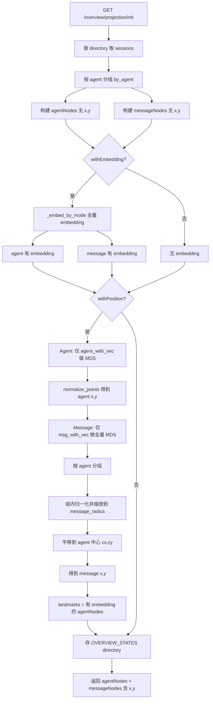
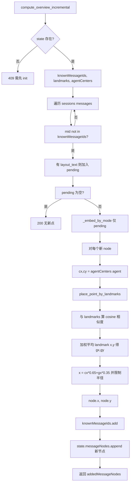

# Overview 布局逻辑解读与问题分析

本文档逐段解读 Overview 的布局与等高线逻辑，并分析「没有点也有等高线」「点重合」等可能原因，便于汇报与后续优化。

---

## 一、整体数据流（谁算布局、谁画图）

- **后端**：负责 **embedding** 和 **二维布局计算**（MDS/landmark），返回 `agentNodes` / `messageNodes` 的 `x`, `y`（归一化到 `[-1, 1]`）。
- **前端**：只做 **线性缩放**（把 `[-1,1]` 映射到 SVG 像素），不重新算布局；并用 **d3-contour 的 contourDensity** 根据**已有像素坐标**画等高线。

所以：
- 若后端返回的 `x/y` 全一样或缺失，前端会看到「点都重合」或集中在中心；
- 等高线是基于「当前画布上点的像素位置」做的密度估计，**只要某 agent 下 ≥3 个点就会画**，即使这些点重叠在一起，也会在重叠处画出一小块等高线（所以会出现「没有分散的点却有等高线」）。

---

## 二、后端逻辑（逐段解读）

### 2.1 初始化：`GET /overview/projection/init`

**文件**：`backend/api/routes.py` → `get_overview_projection_init()`

**步骤概览**：

1. **按 directory 取 session，按 agent 分组**
   - `by_agent = { agent -> [sessions] }`
   - 每个 agent 选一个「代表 session」（最新一条），用 todo / 第一条 user message / session title / `"agent {name}"` 作为该 agent 的 `embeddingInput`（init 文本）。

2. **构建两类节点（此时还没有 x/y）**
   - **agentNodes**：每个 agent 一个，字段含 `embeddingInput`、`initSource` 等，**没有** `embedding`、`x`、`y`。
   - **messageNodes**：每条「可布局」的 message 一个（仅保留有 text/reasoning/compaction 内容的），只有 `embeddingInput`，**没有** `embedding`、`x`、`y`。

3. **若开启 withEmbedding**
   - 把所有 `agent_nodes[].embeddingInput` 和 `message_nodes[].embeddingInput` 拼成 `texts`，一次性调用 `_embed_by_mode(texts)` 做 embedding。
   - 向量按顺序写回：前 `len(agent_nodes)` 个给 agent，后面给 message。  
   → 此时 **agent 和 message 都有 embedding**。

4. **若开启 withPosition（布局计算）**
   - **Agent 大点**：
     - 只取「有 embedding 且维度≥2」的 agent：`agent_with_vec`。
     - 若 ≥2 个：用 `_reduce_vectors_2d(agent_vecs, reduction_algo)`（即 `overview_layout.py` 里的 **经典 MDS** 或 t-SNE）得到二维点，再 `normalize_points` 到 `[-1,1]`，写回每个 agent 的 `x`, `y`。
     - 若 1 个：`x,y = 0,0`。
     - 无 embedding 的 agent：在 x 轴上均匀排开一点（避免完全重合）。
   - **Message 小点**：
     - 同样只取有 embedding 的 message：`msg_with_vec`。
     - 若 ≥2 个：**全量**对 `msg_vecs` 做 MDS/t-SNE，得到 `msg_points`（全局二维坐标），临时存为每个节点的 `_gx`, `_gy`。
     - 然后**按 agent 分组**，在每个 agent 内：
       - 把该 agent 下所有 message 的 `_gx,_gy` 局部归一化到 `[-1,1]`，再乘以 `message_radius`，**平移到该 agent 的 (cx,cy)**：  
         `x = cx + lx * message_radius`, `y = cy + ly * message_radius`。
     - 这样 message 点会**聚在各自 agent 中心附近**，不会跑满全图。
   - 最后删掉 `_gx,_gy`，只保留 `x,y`。

5. **建立增量状态（Landmark 用）**
   - `landmarks` = 当前 **agentNodes** 中「有 embedding」的节点，每条存 `agent, sessionId, embedding, x, y`。
   - **注意**：landmark **只有 agent**，没有把已有 message 点加入 landmark。
   - `agentCenters` = 每个 agent 的 `(x,y)`。
   - `knownMessageIds` = 当前所有 messageNodes 的 `messageId`。
   - 把这些和 `messageNodes`、`agentNodes`、`agentEdges` 一起放进 `OVERVIEW_STATES[directory]`，供增量用。

**小结**：init 时 **agent 用 MDS 全量布局**，**message 也是全量 MDS 再按 agent 局部缩放到中心附近**；**已有 message 不会**在后续增量里再更新位置，只作为「已存在的点」存在 state 里。

---

### 2.2 增量：`compute_overview_incremental` / `GET /overview/projection/incremental`

**文件**：`backend/api/routes.py` → `compute_overview_incremental()`，以及 `overview_layout.py` → `place_point_by_landmarks()`。

**前提**：必须先调过 init，且 `_overview_states()[directory]` 存在（含 `landmarks`、`agentCenters`、`knownMessageIds` 等）。

**步骤**：

1. **找出「新 message」**
   - 遍历该 directory 下所有 session 的 messages，若 `messageId not in knownMessageIds` 且能抽出 layout_text（text/reasoning/compaction），则加入 `pending`。
   - 为每个 pending 生成 `nodeId`、`embeddingInput` 等，**此时还没有 embedding 和 x,y**。

2. **对新 message 做 embedding**
   - 只对 `pending` 的 `embeddingInput` 调一次 `_embed_by_mode`，得到向量写回 `node["embedding"]`。

3. **对新 message 算位置（Landmark 逻辑）**
   - 对每个 pending 的 `node`：
     - `cx, cy = center_by_agent.get(node["agent"], (0,0))`（该 agent 在 init 时的中心）；
     - `x, y = _place_point_by_landmarks(msg_vec=node["embedding"], landmarks=landmarks, agent_center=(cx,cy), message_radius=message_radius)`。
   - **place_point_by_landmarks**（`overview_layout.py`）：
     - 用新 message 的向量与 **所有 landmark（仅 agent）** 的 embedding 算 **cosine 相似度**；
     - 相似度转成权重，对 landmark 的 `(x,y)` 做**加权平均**得到重心 `(gx, gy)`；
     - 再与 `agent_center` 做加权：`x = cx*0.65 + gx*0.35`，`y = cy*0.65 + gy*0.35`；
     - 若该点离 agent 中心超过 `message_radius`，则沿方向缩放到半径内；
     - 最后 clamp 到 `[-1,1]`。
   - 所以**新点的位置只由「agent 锚点」决定**，与已有 message 点无关；**已有 message 点永远不会在增量阶段重新算位置**。

4. **更新状态**
   - 把新 message 的 `messageId` 加入 `knownMessageIds`；
   - 把新节点 append 到 `state["messageNodes"]`；
   - 返回 `addedMessageNodes`（只含新增的节点，带 `x,y,embedding`）。

**小结**：增量时 **只算新 message 的位置**，**锚点是 init 时的 agent 点（landmarks）**；**已存在的 message 点不会重新参与 MDS 或任何更新**，所以不存在「已有点也一起重算」的逻辑。

---

## 三、前端逻辑（逐段解读）

**文件**：`frontend/src/components/agents/OverviewPanel.tsx`

### 3.1 数据来源与初始化

- **agentNodes / messageNodes** 来自：
  - 切 directory 时调 `api.overview.projectionInit(...)`，用返回的 `agentNodes`、`messageNodes` 设 state，并写入 `OVERVIEW_INIT_CACHE`。
- **增量**：
  - 后端通过 SSE 推送 `overview.incremental`，payload 里带 `addedMessageNodes`；
  - 前端在 `useEffect` 里根据 `overviewIncrementalEvent`，把 `addedMessageNodes` 里**未在 messageNodeMapRef 中出现过的**节点 append 到本地 `messageNodes` 和 cache，**不覆盖已有点的坐标**。

所以前端**完全信任**后端给的 `x,y`，没有二次布局计算。

### 3.2 投影到像素（project）

- `useMemo` 里：`rawPoints = [ ...agentNodes, ...messageNodes ].map(n => ({ x: n.x ?? 0, y: n.y ?? 0 }))`。
- 用这些点的 `x,y` 算 **minX, maxX, minY, maxY**（若全相同则人为拉开 1，避免除 0）。
- 再对域做约 8% 的 padding，然后用**线性映射**把 `[minX,maxX]` → `[safePadding, width-safePadding]`，`[minY,maxY]` → `[safePadding, height-safePadding]`，得到每个节点的 `px, py`。
- 因此：**若后端返回的 x,y 全部相同或缺失（当 0 处理），所有点会落在同一像素附近**，看起来就是「没有点」或「只有一个点」。

### 3.3 等高线（KDE）怎么画

- **数据**：`projectedMessages`（即上面带 `px, py` 的 message 节点列表）。
- **条件**：`projectedMessages.length >= 3` 才进入等高线逻辑；否则 `densityContours = []`，不画。
- **按 agent 分组**：`groups = Map<agent, {x,y}[]>`，每个 agent 对应「该 agent 下所有 message 的 (px, py)」。
- **对每个 agent**：
  - 若该 agent 下 `pts.length < 3`，跳过。
  - 否则用 **d3-contour** 的 `contourDensity()`：
    - `.x(d => d.x)`, `.y(d => d.y)`：用像素坐标；
    - `.size([width, height])`：画布范围；
    - `.bandwidth(22)`：核密度估计的带宽（像素）；
    - `.thresholds(6)`：等高线层级数；
    - 调用 `density(pts)` 得到一组等高线多边形，再转成 SVG `path` 的 `d`。
  - 每条等高线带 `agent` 和 `color`，push 到 `densityContours`。
- **渲染**：在 SVG 里先画 `densityContours`（fillOpacity 0.06，strokeOpacity 0.12），再画边、message 小点、agent 大点。

**为何「没有点也有等高线」**：

- 这里「没有点」更可能是指：**看不到分散的小点**（因为都叠在一起），但**数据上仍有 ≥3 个 message 点**。
- 只要同一 agent 下有 ≥3 个点，就会对该 agent 画等高线；若这些点的 `(px, py)` 几乎相同（后端 x,y 重合或非常接近），密度会集中在一个小区域，等高线就变成**一小块 blob**，看起来像「只有等高线、没有明显点」。
- 另一种情况：若后端**没返回 x,y**，前端会把 `x,y` 当 0，所有点落在 (0,0) 映射后的像素，同样会有一团密度，从而有一条/一块等高线。

---

## 四、流程图（Mermaid）

### 4.1 后端 Init 布局流程



### 4.2 后端 Incremental（Landmark）流程



### 4.3 前端投影与等高线

```mermaid
flowchart TD
    A[agentNodes + messageNodes] --> B[rawPoints = 取 n.x, n.y 缺则 0]
    B --> C[minX,maxX,minY,maxY]
    C --> D[域 padding 8%]
    D --> E[线性映射到 px,py]
    E --> F[projectedMessages, projectedAgents]
    F --> G{projectedMessages.length >= 3?}
    G -->|否| H[densityContours = []]
    G -->|是| I[按 agent 分组 groups]
    I --> J[对每个 agent]
    J --> K{pts.length >= 3?}
    K -->|否| L[跳过]
    K -->|是| M[contourDensity.x.y.size.bandwidth.thresholds]
    M --> N[density pts 得等高线]
    N --> O[转 SVG path 入 densityContours]
    O --> P[渲染: 等高线 -> 边 -> 小点 -> 大点]
    L --> P
    H --> P
```

---

## 五、Landmark 设计要点（回答你的第 3 点）

- **锚点是谁**：目前 **landmarks 只有 init 时的 agent 节点**（带 embedding 的），**没有**把已有 message 点加入 landmarks。
- **是否更新已有点**：**不更新**。增量时只对「新出现的 message」算位置；已有 message 的坐标永远保持 init 时算出的那一次，不会在 incremental 里重算。
- **新点怎么算**：新 message 的向量只和 **agent landmarks** 做相似度加权，再和 **agent 中心** 融合并限制在 `message_radius` 内。所以新点位置**只依赖 agent 锚点**，不依赖已有 message 点。

若你希望「已有 message 也参与锚点」，就需要改设计：例如把已存在的 message 也加入 `landmarks`，并在增量时用「landmark 集合」对新点做加权（同时要决定是否在某一时刻对「已有点」做一次重算或保持不动）。

---

## 六、可能的问题与对应原因

| 现象 | 可能原因 |
|------|----------|
| **看不到分散的点 / 点都在一起** | 1) 后端 init 时 `message_radius` 过小或按 agent 归一化后几乎没拉开；2) 后端返回的 message 的 `x,y` 缺失或全为 0（前端当 0 用会叠在中心）；3) 只有 1 个 agent 且只有 1 条 message，MDS 单点就是 (0,0)。 |
| **没有点也有等高线** | 数据上其实有 ≥3 个 message 点，但它们的 `x,y` 相同或非常接近，在画布上叠成一点；等高线按**像素密度**画，重叠点仍会形成一小块密度，所以会看到一团等高线而看不到分散点。 |
| **全部 x,y 为 0,0** | **根因**：当只有 1 个 agent 时，原逻辑将其放在 (0,0)；单 message 直接取 agent 中心 → (0,0)；增量新 message 用 landmark 加权，landmark 只有该 agent 在 (0,0) → 加权结果仍是 (0,0)。**修复**：单 agent 改为 (0.2, 0.2)，不再使用 (0,0) 和 y=0；message 最终坐标 clamp 到 [-1,1]；默认 messageRadius 改为 0.35。 |
| **为何看起来「只有一个 agent」** | 1) **缓存**：后端/前端会缓存 init 结果，若之前某次请求该 directory 时只有 1 个 session 或 1 种 agent，缓存里就是 1 个 agent；调用失败后重试可能仍命中旧缓存。→ 用「刷新」或 `clearCache=true` 清缓存再试。2) **按 agent 类型聚合**：`by_agent` 按 `agent` 字段分组，多个 session 同一种 agent（如都是 `general`）只会产生**一个** agent 节点。所以「多个 session」不等于「多个 agent 节点」。 |
| **如何清缓存** | **API**：init 时加查询参数 `clearCache=true`（或 `1`、`yes`），后端会删除该 directory 的状态并重新计算。**前端**：Overview 图下方 Legend 旁有「刷新」按钮，点击会清本地缓存并带 `clearCache: true` 重新请求。 |
| **布局没有计算** | 若 `withPosition` 为 false，后端不会写 `x,y`，前端会把这些节点都当 (0,0) 映射，所有点重合。可检查 init 请求参数和返回的 `debug.position`、`messageNodesSample` 是否有 `x,y`。 |
| **初始化就全重合** | 1) 只有 1 个 agent 且 message 很少，MDS 结果可能都挤在一起；2) `assign_overview_positions` 在本接口**未使用**（init 是在 routes 里手写「先 agent MDS，再 message 全量 MDS + 按 agent 缩放」），若某处漏写 `x,y` 会得到 0。 |

---

## 七、建议的下一步

1. **确认后端是否真的写了 x,y**
   - 在浏览器 Network 里看 `/overview/projection/init` 的响应里 `messageNodes`（或 `messageNodesSample`）是否每条都有不同的 `x`, `y`。
   - 看后端日志 `[overview.init] positions=...` 里 `messageNodesSample` 的 `x,y` 是否多样。

2. **确认前端是否收到并用于投影**
   - 在 OverviewPanel 里对 `messageNodes` 打 log，看 `n.x, n.y` 是否有有效数值；再看 `rawPoints` 的 min/max 是否合理（不全为 0）。

3. **等高线在「点重合」时的表现**
   - 若确认是点重合导致「只见等高线不见点」，优先修布局（见上），等高线会随之正常；若希望**没分散点时不画等高线**，可加条件：例如仅当该 agent 下点的「像素坐标方差」大于某阈值再画该 agent 的等高线。

4. **Landmark 是否要包含已有 message**
   - 若希望新点更贴近「已有 message 的分布」，可以把 init 得到的 messageNodes（或其中一部分）也加入 `landmarks`，并在 `place_point_by_landmarks` 里用「agent + message」一起加权；同时要约定已有 message 在增量阶段是否允许被重新计算（当前是不重算）。

5. **message_radius 与 init 缩放**
   - 若觉得点太挤，可适当调大 `message_radius`（后端 init 与 incremental 都会用），或检查按 agent 组内归一化时 `span_x/span_y` 为 0 的边界情况（当前有 `or 1.0`，单点会落在中心）。

按上述顺序排查，可以区分「没算布局」「算错/写错」「Landmark 设计限制」三类问题，再决定是修后端布局、调参，还是改 Landmark 设计。

---

## 八、汇报用一页摘要

- **布局谁算**：后端（init 时 MDS 全量算 agent + message；增量时只用 agent 作 landmark 算新 message）。
- **前端做什么**：只做 (x,y)→(px,py) 线性缩放 + 用 d3-contour 的 contourDensity 按像素画等高线；不重新算布局。
- **等高线**：按 agent 分组，每组 ≥3 个点就对该组点的**像素坐标**做核密度估计画等高线；若点都重合，会看到一小块等高线而没有分散点。
- **Landmark**：锚点 = init 时的 **agent 节点 + 已有 message 节点**（位置冻结，仅新 message 用 landmark 加权算位置）。
- **Directory**：后端对 directory 做规范化（`\` → `/`、去尾斜杠），Postman 传 `D:\\projects\\...` 与 store 里 `D:/projects/...` 会匹配；sessionCount=0 时 debug 里会有 `storeSessionCount`、`availableDirectories` 便于排查。
- **可能问题**：1) directory 未匹配 → sessionCount=0（看 debug.availableDirectories）；2) 后端没写/写错 x,y → 点全在中心；3) 点重合但数量≥3 → 有等高线无分散点。
- **建议**：先看 init 的 debug.sessionCount、debug.availableDirectories；再查 messageNodes 的 x,y 是否多样。

---

## 九、错误定位与检验（调用链、文件与行号）

### 9.1 为何会拿到 0 个点（sessionCount=0）

- **原因**：该 directory 下**没有匹配到任何 session**，不是布局或增量逻辑错。常见情况：URL/Postman 传的 directory 与 store 里存的 directory **字符串不一致**（例如 `D:\\projects\\...` vs `D:/projects/...`）。
- **调用链**：
  1. 请求进入：`GET /api/overview/projection/init?directory=...`  
     → **文件** `backend/api/routes.py`，**行号**约 **260**：`directory = request.args.get("directory")...`
  2. 规范化：**同文件**约 **262**：`norm_dir = _normalize_directory(directory)`  
     → **同文件**约 **38–48**：`_normalize_directory()` 把 `\` 换成 `/` 并 strip。
  3. 过滤 session：**同文件**约 **290**：  
     `sessions = [s for s in _store().all_sessions() if _normalize_directory(s.get("directory") or "") == norm_dir]`  
     → 若这里 `sessions` 为空，后面 `agent_nodes`、`message_nodes` 全为空。
  4. Store 来源：`_store().all_sessions()` 实现在 **`backend/store/memory_store.py`** 约 **136–143** 行；session 的 `directory` 来自 SSE 事件，在 **`backend/handlers/event_router.py`** 约 **47**（session.created）、**70**（session.updated）。

- **如何检验**：
  - 用 Postman 调 init 后看响应里的 **`debug.storeSessionCount`**、**`debug.availableDirectories`**（仅当 sessionCount=0 时会有）。
  - 若 `storeSessionCount > 0` 且 `availableDirectories` 里有你期望的路径（可能是 `D:/projects/built_by_oc/test1`），则用**该字符串**再调 init（或前端用返回的 `directory`/norm 后的目录）。
  - 确认 OpenCode/前端推送到后端的 session 里 `directory` 字段是否与你在 Postman 里传的一致（或传 norm 后的目录）。

### 9.2 布局计算与 Landmark 的代码位置

- **Init 布局（MDS + 按 agent 缩放 message）**  
  - **文件**：`backend/api/routes.py`  
  - Agent 的 x,y：约 **511–517**（`agent_with_vec`、`_reduce_vectors_2d`）。  
  - Message 的 x,y：约 **521–545**（`msg_with_vec`、`_reduce_vectors_2d`，再按 agent 归一化并 `message_radius` 缩放）。  
  - MDS/归一化实现：**`backend/services/overview_layout.py`**，`classical_mds_2d` 约 **113–141**，`normalize_points` 约 **78–90**。

- **增量 Landmark 加权**  
  - **文件**：`backend/api/routes.py`  
  - 取 state、pending、embedding、算位置：约 **97–183**（`compute_overview_incremental`）。  
  - 单点位置计算：**`backend/services/overview_layout.py`**，`place_point_by_landmarks` 约 **302–341**。

- **Landmark 组成（init 时写入 state）**  
  - **文件**：`backend/api/routes.py` 约 **602–619**：  
    `landmarks = agent_landmarks + message_landmarks`，其中 agent/message 均需有 `embedding` 和 `x,y`；已有 message 只作锚点，不在此后重算。

### 9.3 前端使用与等高线

- **文件**：`frontend/src/components/agents/OverviewPanel.tsx`  
- 拿 init 数据：约 **149–186**（`api.overview.projectionInit`、setState）。  
- 投影到像素：约 **261–318**（`rawPoints`、min/max、`project`、`projectedMessages`/`projectedAgents`）。  
- 等高线：约 **326–361**（`densityContours`、`contourDensity`、按 agent 分组 ≥3 个点）。

按上述行号可快速定位「directory 匹配 → session 过滤 → 布局 → landmark → 前端投影与等高线」整条链路并做断点或 log 检验。
